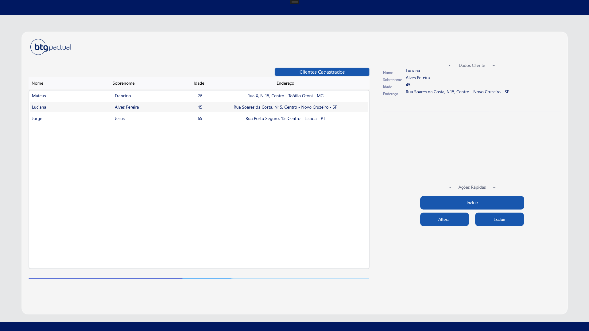
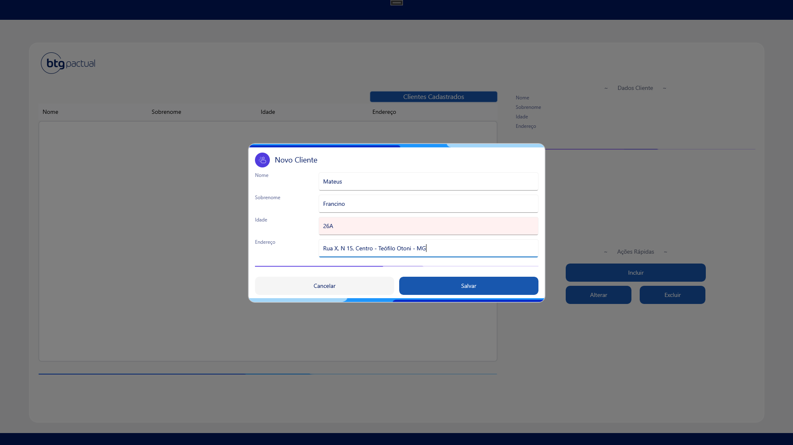
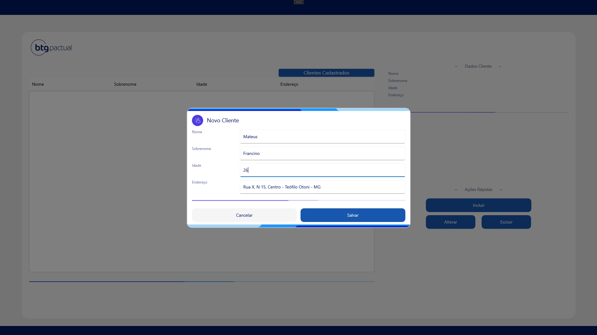
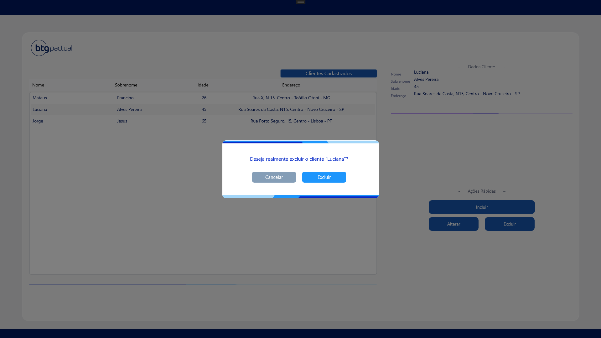

# MeuClienteApp

Aplicação exemplo em .NET MAUI para cadastro de clientes.  
O sistema permite listar, incluir, editar e excluir clientes utilizando MVVM e popups.

## Funcionalidades
- Listagem de clientes
- Adição e edição em popup
- Exclusão com confirmação
- Validação básica dos campos

## Tecnologias
- .NET MAUI
- CommunityToolkit.MVVM
- Mopups
- Injeção de Dependência

## Telas

## Como executar
1. Clone o repositório
2. Restaure os pacotes (`dotnet restore`)
3. Rode o projeto (`dotnet build` e `dotnet run` ou F5 no Visual Studio)

---

**Obs:** A persistência foi feita em um arquivo JSON simples apenas para demonstrar conceitos e camadas da aplicação (services, viewmodels etc).  
Em um cenário real, seria substituído por um banco de dados ou API.

